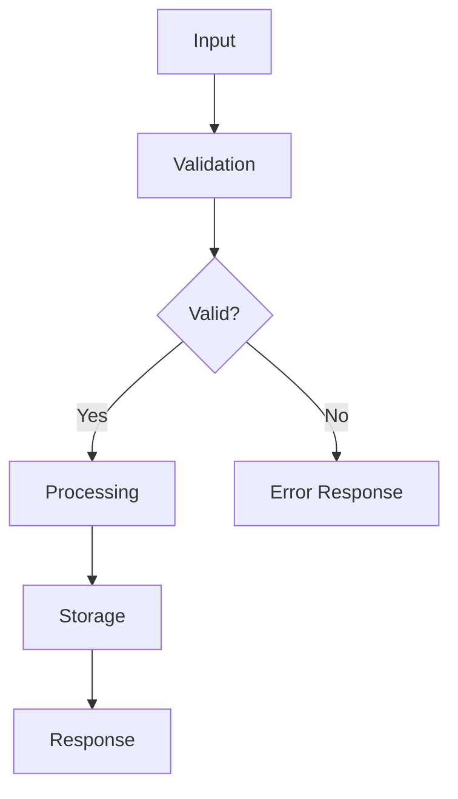

# Data Flow Guide

## Purpose
This guide explains how to design and document data flow between modules, features, and external systems.

## Data Flow Principles

### 1. Clear Data Paths
Data should flow through predictable paths:
- Input → Validation → Processing → Storage → Output
- Each step should be clearly defined

### 2. Immutable Where Possible
Prefer immutable data structures:
- Makes data flow easier to reason about
- Reduces side effects and bugs

### 3. Single Source of Truth
Each piece of data should have one authoritative source:
- Avoid duplicating data across modules
- Use references or IDs when needed

### 4. Clear Transformations
Document how data transforms at each step:
- Input format → intermediate formats → output format

## Data Flow Patterns

### 1. Request-Response Pattern
Simple synchronous flow:

```
User/API → Service → Repository → Database
    ↓         ↓           ↓
Response ← Process ← Query Result
```

### 2. Event-Driven Pattern
Asynchronous flow using events:

```
Event Producer → Event Bus → Event Consumer 1
                            → Event Consumer 2
                            → Event Consumer 3
```

### 3. Pipeline Pattern
Sequential transformations:

```
Input → Step 1 → Step 2 → Step 3 → Output
         ↓         ↓         ↓
       T1        T2        T3
```

### 4. Repository Pattern
Abstract data access:

```
Service → Repository Interface → Implementation
                                  ↓
                               Database/API/File
```

## Data Flow Documentation

### Flow Diagram Template



### Data Structure Flow Template

```markdown
## Feature: [Feature Name]

### Data Flow Steps

1. **Input**
   - Source: [User/API/Another Module]
   - Format: [Data type/structure]
   - Example: `[example]`

2. **Validation**
   - Rules: [validation rules]
   - Output: [validated data or error]

3. **Processing**
   - Transformations: [what happens]
   - Dependencies: [what data/services needed]
   - Output: [processed data]

4. **Storage** (if applicable)
   - Storage location: [database/file/etc]
   - Storage format: [how data is stored]
   - Indexes: [if database, what indexes]

5. **Output**
   - Format: [response format]
   - Example: `[example]`

### Data Structures

**Input Structure:**
```python
class InputType:
    field1: type
    field2: type
```

**Internal Structure:**
```python
class InternalType:
    field1: type
    field2: type
    derived_field: type
```

**Output Structure:**
```python
class OutputType:
    field1: type
    field2: type
    metadata: type
```

### Error Flow

**Validation Errors:**
- When: [when they occur]
- Response: [error format]
- HTTP Status: [if API, status code]

**Processing Errors:**
- When: [when they occur]
- Response: [error format]
- Retry logic: [if applicable]

### Performance Considerations
- Data size: [expected size]
- Caching: [if applicable]
- Optimization: [any optimizations]
```

## Example: Create Task Data Flow

### Data Flow Steps

1. **Input**
   - Source: User via API
   - Format: JSON POST request
   - Example:
   ```json
   {
     "title": "Complete project",
     "description": "Finish the TDD project",
     "due_date": "2026-02-10"
   }
   ```

2. **Validation**
   - Rules:
     - title: required, max 200 chars
     - description: optional, max 1000 chars
     - due_date: optional, must be future date
   - Output: Validated CreateTaskRequest object or ValidationError

3. **Processing**
   - Transformations:
     - Generate unique task ID (UUID)
     - Set status to "pending"
     - Set created_at to current timestamp
   - Dependencies: None
   - Output: Task object with all fields

4. **Storage**
   - Storage location: PostgreSQL database
   - Storage format: tasks table
   - Indexes: id (primary), user_id, status

5. **Output**
   - Format: JSON response
   - Example:
   ```json
   {
     "id": "550e8400-e29b-41d4-a716-446655440000",
     "title": "Complete project",
     "description": "Finish the TDD project",
     "status": "pending",
     "created_at": "2026-02-03T10:30:00Z",
     "due_date": "2026-02-10T00:00:00Z"
   }
   ```

### Data Structures

**Input Structure:**
```python
class CreateTaskRequest:
    title: str
    description: Optional[str]
    due_date: Optional[datetime]
```

**Internal Structure:**
```python
class Task:
    id: str  # UUID
    title: str
    description: Optional[str]
    status: TaskStatus  # enum
    created_at: datetime
    due_date: Optional[datetime]
    user_id: str  # from auth context
```

**Output Structure:**
```python
class TaskResponse:
    id: str
    title: str
    description: Optional[str]
    status: str
    created_at: str  # ISO format
    due_date: Optional[str]  # ISO format
```

### Error Flow

**Validation Errors:**
- When: Input validation fails
- Response:
  ```json
  {
    "error": "validation_error",
    "message": "Title cannot be empty",
    "details": {
      "field": "title",
      "constraint": "required"
    }
  }
  ```
- HTTP Status: 400 Bad Request

**Processing Errors:**
- When: Database operation fails
- Response:
  ```json
  {
    "error": "database_error",
    "message": "Failed to save task"
  }
  ```
- HTTP Status: 500 Internal Server Error
- Retry logic: No, user should retry manually

### Performance Considerations
- Data size: Small (< 1KB per task)
- Caching: Not needed for individual tasks
- Optimization: Use connection pooling for database

## Cross-Feature Data Flow

### Example: User Creates Task

```
1. User authenticates
   └─ Auth Service → User Context
   
2. User creates task
   └─ API → Task Service
       ├─ Validates input
       ├─ Creates task
       └─ Saves to database (with user_id)
   
3. Notification sent
   └─ Task Service → Event Bus
       └─ Notification Service
           └─ Sends email/notification
```

### Data Structures Crossing Boundaries

```python
# Auth Service provides
class UserContext:
    user_id: str
    email: str
    permissions: List[str]

# Task Service uses
class Task:
    # ... other fields
    user_id: str  # From UserContext
    
# Notification Service receives
class TaskCreatedEvent:
    task_id: str
    user_id: str
    title: str
    created_at: datetime
```

## Best Practices

1. **Document Flows**: Visual diagrams + written description
2. **Validate Early**: Validate at input boundaries
3. **Transform Clearly**: Document all transformations
4. **Handle Errors**: Define error flow for each step
5. **Consider Performance**: Document size, caching, optimization
6. **Trace Data**: Use IDs to track data through flow
7. **Test Flows**: Integration tests for complete flows